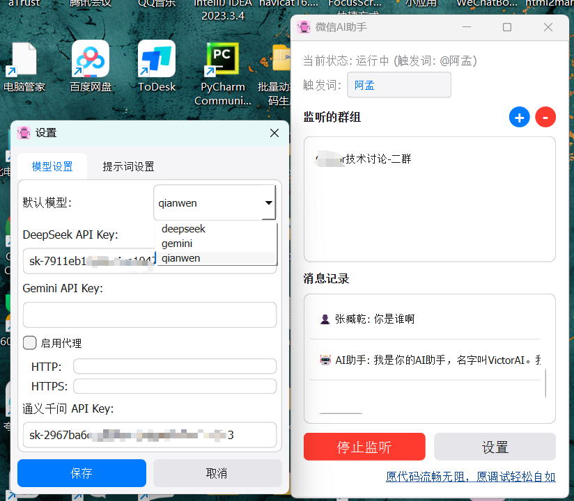
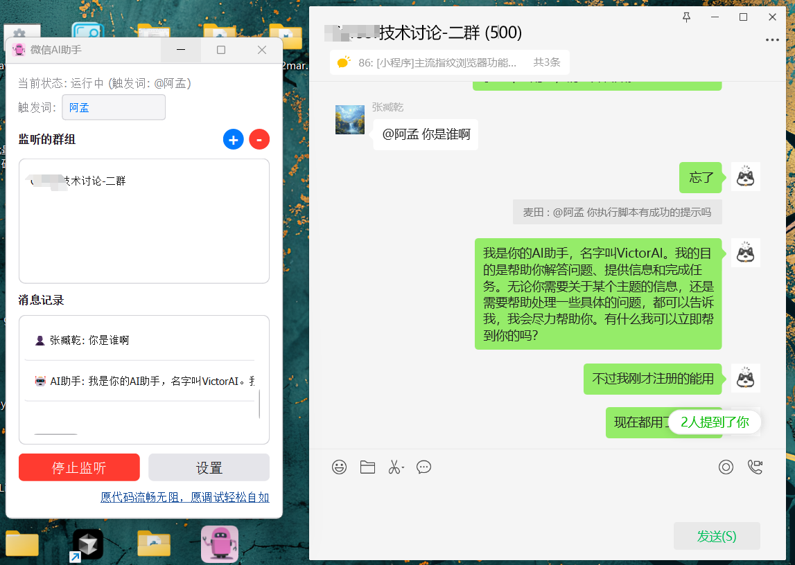

# WeChatAI 智能助手

## 项目介绍
WeChatAI 是一款基于 Python 开发的微信聊天的智能助手，支持多种大语言模型，可以实现智能对话、自动回复等功能。采用现代化的界面设计，操作简单直观。
[项目地址](https://github.com/as967418/WeChatAI)

## 功能特点
- 支持多个AI模型（DeepSeek、Gemini、通义千问）
- 支持多个人/群组同时监听
- 自定义触发词
- 实时消息记录显示
- 简洁美观的 macOS 风格界面
- 支持窗口置顶
- 问答数据本地存储，保护隐私
  
## 使用截图

## 系统要求
- Windows 10/11 64位操作系统
- 微信 PC 版本 >= 3.9.0
- 网络连接稳定

## 安装说明
1. git clone后，运行requirements.txt文件，安装依赖
2. 使用pyinstaller打包，生成WeChatAI.exe
3. 确保微信已登录并保持运行
4. 运行 WeChatAI.exe 即可使用

**还不会的加QQ群联系作者**

## 使用指南

### 基本设置
1. 启动程序后，点击"设置"按钮配置 AI 模型的 API 密钥
2. 在主界面设置触发词（默认为"AI"）
3. 点击"+"按钮添加需要监听的微信群/个人（有备注填备注，无备注填昵称）
4. 点击"开始监听"启动服务
**电脑性能决定了启动监听的速度，同时监听的数量，建议不要超过3个**

### 日常使用
1. 在已添加的微信群/个人中，使用 "@AI" 或设定的触发词来召唤 AI
2. AI 将自动回复消息
3. 主界面实时显示对话记录
4. 可随时添加或移除监听的群组

### 注意事项
- 请确保微信处于登录状态
- 添加群组时需要输入完整的群名称
- 建议使用自己的 API 密钥以获得最佳体验
- 程序关闭后需要重新启动监听服务

## 常见问题

### 无法启动监听
- 检查微信是否正常运行
- 确认是否已添加群组
- 验证 API 密钥是否正确配置

### 群组添加失败
- 确保群名称输入正确
- 检查是否已经添加过该群组
- 确认微信窗口正常显示

### AI 无响应
- 检查网络连接
- 验证 API 密钥有效性
- 确认触发词使用正确

## 技术支持

## 联系方式

---

### 📚 推荐阅读

-   [无限畅用Cursor 编辑器，四步轻松搞定！](https://www.allfather.top/archives/cursormian-fei-mi-ji-si-bu-jie-suo)
-   [历时两周半开发的一款加载live2模型的浏览器插件](https://www.allfather.top/archives/live2dkan-ban-niang)
-   [github优秀开源作品集](https://www.allfather.top/mol2d/)

---

## 许可协议
[GPL](https://opensource.org/license/gpl-1-0)

## 免责声明
本软件仅供学习交流使用，请勿用于商业用途。使用本软件产生的任何后果由用户自行承担。
